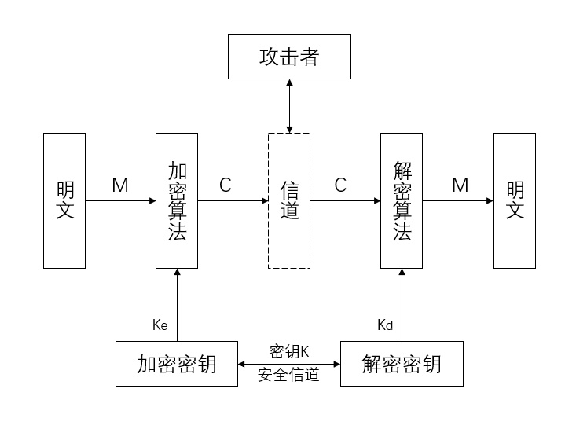

# 第三章 密码学（一）*

## 3.1 密码学基本概念

### 1. 密码学的安全目标

目标至少包含三个方面：

#### 1.1 **保密性**

- 信息仅被合法用户访问，不被泄露给非授权的用户、实体或过程。
- 提高保密性的手段：防侦查、防辐射、数据加密、物理保密等。

#### 1.2 完整性

- 资源只有授权方或以授权的方式进行修改，所有资源没有授权则不能修改
- 影响完整性的因素：故障、误码、攻击、病毒等。

#### 1.3 可用性

- 资源只有在适当的时候被授权访问，并按照需求使用
- 保证可用性的手段：身份识别与确认、访问控制等。

### 2.密码体制

通常一个密码系统（简称密码体制）由以下五个部分组成，模型如下图：

- 明文空间M：全体明文的集合
- 密文空间C：全体密文的集合
- 加密算法E：一组明文M的到密文C的加密变换
- 解密算法D：一组密文C到明文M的解密变换
- 密钥空间K：包含加密密钥K_e和解密密钥K_d的全体密钥集合。

### 3. 攻击密码的方法和类型

#### 3.1 密码攻击方法

- 穷举攻击
- 统计分析攻击
- 数字分析攻击

#### 3.2 攻击密码类型（19考过）

- 仅知密文攻击
- 已知明文攻击
- 选择明文攻击
- 选择密文攻击

### 4. 古典密码

#### 4.1 古典密码的分类

- 置换密码
- 代替密码：
  - 单表密码
    - 加法密码
    - 乘法密码
  - 多名码密码
  - 多字母密码
  - 多表密码
- 代数密码

香农通过数学方法证明了，一次性密钥如果及时销毁所有使用的密钥页，即使对方拿到了密码本的其余部分，也无法解密。

#### 4.2 古典密码的破解

- 穷举分析
- 统计分析

### 5. 量子算法

目前实用的有Shor和Grover，由于技术不成熟，暂时无法对当前的密码体系构成威胁。

抗量子密码、编码密码等用于研究对抗量子算法。

## 3.2 分组密码

分组密码又称为秘密钥密码或对称密码。使用分组密码对明文加密时，首先对明文分组，每组长度相同，然后对每组明文分组，每组长度相同，然后对每组明文分别加密的到等长的密文。

### 1. DES

#### 1.1 概述

DES分组长度为64比特，使用56比特秘钥对64比特的明文进行16轮加密，得到64比特的密文串。其中，**秘钥为64比特，实际使用56比特，另外8位用作奇偶校验。**

DES使用的对合运算，即
$$
f=f^{-1}
$$

加密和解密为同一算法，总的工作量减半。

#### 1.2 DES的加密过程的公式描述

$$
L_i = R_{i-1}  \\
R_i = L_i \bigoplus f(R_{i-1},K_i)  \\
i=1, 2, ... , 16  \\
$$
   上一轮的输出为下一轮的输入（P39~45）

#### 1.3 DES的安全性

- 如果DES秘钥太短经不起穷举攻击
- DES存在弱密钥和半弱密钥
  - 弱密钥：秘钥的子秘钥相同，明文连续加密两次得到明文，加密和解密的结果一致。
  - 半弱密钥：秘钥的部分子秘钥相同。

#### 1.4 3DES

执行3次DES，安全性高，软件实现速度慢。有两种加密方式

- 第一次和第三次加密使用统一秘钥，秘钥长度128位（有效112位）
- 三次加密使用不同的秘钥，秘钥长度192位（有效168位）

注：每64位需要8位做奇偶校验。

**目前中国人民银行的智能卡技术规范支持3DES。**

**注：DES会出计算题。**
**S盒，P44页，非线性压缩变换；置换运算，P45**

todo 例题

### 2. AES算法

#### 2.1 数学基础

AES明文分组长度可以是128位，192位，256位；秘钥长度也可以是128位，192位，256位。

重点：面向字节的乘法运算：P46

- 面向字节的乘法运算，本质是对应于$$f(x)modm(x)$$运算，其中

$$
m(x)=x^8+x^4+x^3+x+1
$$

例1：
$$
57\bigoplus83=(x^6+x^4+x^2+x+1)\bigoplus(x^7+x+1) \\
=x^7+x^6+x^4+x^2 \\
=(1101 0100)_2 \\
=(D4)_16
$$
例2：
$$
57\cdot83=x^{13}+x^{11}+x^9+x^8+x^6+x^5+x^4+x^3+1mod(x^8+x^4+x^3+x+1) \\
=x^7+x^6+1 \\
=(1100 0001)_2 \\
=(C1)_16
$$
注：系数为偶数消去

- 乘法逆元

  如果有a(x)b(x)=1modm(x)，则a(x)的乘法逆元为b(x)

  例如：(67*16)mod119=1，所以67mod119的逆元为16，求解方式可以参考辗转相除法。

- 乘法的计算机实现：xtime()

  xtime()是最高多项式不大于7的多项式b(x)乘以x的乘法运算
  $$
  b_6b_5b_4b_3b_2b_1b_00 \ \ \ \ b_7=0 \\
  b_6b_5b_4b_3b_2b_1b_00\bigoplus0001 1011 \ \ \ \ b_7=1
  $$
  即$b_7=0$，左移一位，$ b_7=1 $，左移一位，再亦或1B

- 面向4字节的运算 P48略

#### 2.2 算法框架

AES状态（明文和秘钥都用“状态”表示）

（1）明文state：明文state用二维数组表示，该数组为4行，$N_b$列。数组每个元素表示1字节，即2个16进制数。
$$
N_b=数据块长度/32  \ \ \ \ 128=>N_b=4，192=>N_b=6
$$
（2）秘钥state同上，为4×N_k
$$
N_k=数据块长度/32
$$
（3）加密轮数$N_r$，取决于N_b和N_k的值，如下

| N_r   | N_b=4 | N_b=6 | N_b=8 |
| ----- | ----- | ----- | ----- |
| N_k=4 | 10    | 12    | 14    |
| N_k=6 | 12    | 12    | 14    |
| N_k=8 | 14    | 14    | 14    |

​	AES过程略，重点在读S盒，矩阵相乘

​	注：在行位移时：1=>0，2=>1，3=>2，4=>3

​	（1）当秘钥成都为128bit，192bit时，移动规则不变

​	（2）为256bit时，规则为第4hang左移4字节

​	

​	AES不是对合运算，即(AES)^(-1) != AES，解密是加密的逆过程

### 3. SM4

​		处于安全性和确定性考虑，**2006年**我国国家密码管理局公布了“无线局域网产品”使用的SM4算法，可以抵御**差分攻击**、**线性攻击**，是我国第一次公布的官方的商品密码算法。

特点：

- SM4分组长度和秘钥长度为128位，SM4数据处理单位：字节(4)，位(32)
- 属于对合运算，加密算法和解密算法一致，只有论秘钥使用顺序相反。

T()函数：非线性变化，目的是混淆。

子秘钥生成：通过“系统参数”和“固定系数”计算而来。

### 4. 分组密码的工作模式

是指以某个分组秘钥算法为基础，解决对任意长度的明文的加密问题的方法。

1980年NIST发布了DES的4中工作模式：电码本模式（ECB），密码分组链接模式（CBC），输出反馈模式（OFB），密码反馈模式（CFB）。

2001年NIST发布AES的5中工作方式：ECB、CBC、OFB、CFB、计数模式。

注：使用工作模式时，明文或密码可能引起密文及其后续密文发生错误。

- **错误传播有界**：出现明文或密文错误只产生有限几个错误数据。

- **错误传播无界**：出现明文或密文错误会引发后续数据全部错误。

## 3.3 序列密码

​		序列密码又称为流密码，是明文流和秘钥流按顺序逐比特进行异或运算，从而产生密文流。属于对合运算。序列密码强度依靠秘钥序列的随机性和不可预测性。**序列密码中的关键是保持通信双方精确同步。**

#### 1.  线性反馈移位寄存器（计算题！）P64

#### 2. RC4算法：

S表有256个字节，可能的排列有256!，穷举几乎不可能。（现在已经不太安全了）

#### 3. ZUC：祖冲之算法

​		是由我国自助设计的加密和完整性算法，已被国际组织3GPP推荐为无线通信LTE的第3套加密标准的核心算法。ZUC是一个同步流产生算法。

## 3.4 HASH函数

哈希函数用于构建数据的“指纹”，而“指纹”用于标记数据。主要用于数据完整性、数字签名、消息认证等。是将任意长度的消息输出为定长消息的函数。
$$
x=h(m)
$$
Hash函数的特性：

- 单向性
- 弱抗碰撞性
- 抢抗碰撞性

### 1. Hash函数的安全性

对Hash函数的攻击就是寻找一对碰撞消息的过程。主要有两种：

（1）穷举攻击：典型方式有“生日攻击”，即产生若干明文消息，并计算出消息摘要，然后进行对比，找到碰撞。

（2）利用散列函数的代数结构。如：中间相遇攻击、修正分组攻击和差分分析攻击等。

本人注：常用的方式也有使用**彩虹表**对hash值进行破解（https://www.cmd5.com/），原理大致是生成若干个中间结果，从明文和密文两头进行连接，具体原理可以查看百度。

引：[什么是彩虹表？](https://www.zhihu.com/question/19790488)、[百度百科](https://baike.baidu.com/item/%E5%BD%A9%E8%99%B9%E8%A1%A8/689313)、[彩虹表原理详解](http://www.ha97.com/4009.html)

### 2. MD5与SHA-1算法

- MD5算法

  消息分组长度为**512**比特，生成**128**比特的摘要。

- SHA-1 算法

  的输入是长度小于2^64-1比特的任何消息，输出**160**比特

  

- 美国国家安全局与国家标准去合作，提出数字安全标准（DDS）及其算法标准（DSA）。DDS数字签名标准的核心是数字签名算法DSA，该算法中杂凑函数采用SHA-1。

### 3. SM3算法

SM3算法是国家密码管理局半步的安全密码杂凑算法，是把长度为len(1<2^64)比特的消息m，经过填充和迭代压缩，生成长度为**256**比特的消息摘要。

可用于数字签名和验证，HMAC的生成与认证，以及随机数的生成。

### 4. HMAC

可用来加密，签名，报文验证等。
$$
HMAC_K=H[(K^+\bigoplus opad)||Hp[K^+\bigoplus ipad]]
$$

